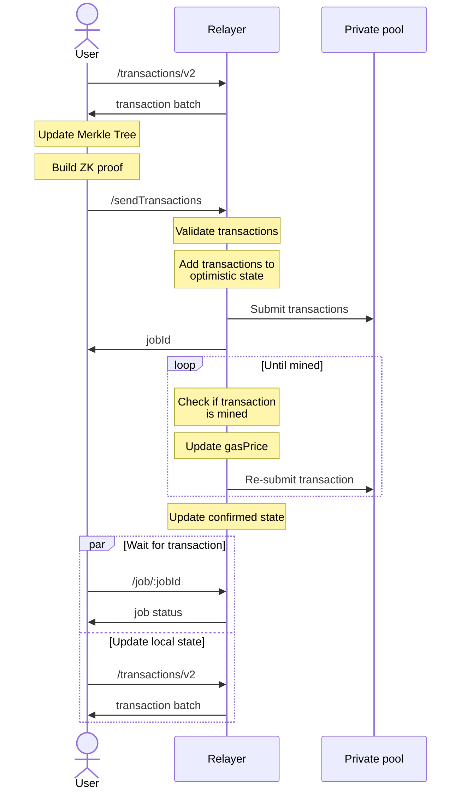

# Relayer for ZkBob application

Relayer's primary role is to deliver user-prepared ZkBob transactions to the private pool contract. Also, it can be used as cache service to conveniently retrieve information about previous transactions, current Merkle Tree state, transaction fees, etc.

## How to start locally

**Docker:**

You can use a pre-built [image](https://github.com/zkBob/zeropool-relayer/pkgs/container/zkbob-relayer) from registry. List of env configuration parameters can be found in [`zp-relayer/.env.example`](zp-relayer/.env.example). The repository [zkBob/relayer-launch](https://github.com/zkBob/relayer-launch) can be used to run the relayer with the docker-compose facility.

## Tests

**Unit tests:**
```bash
cd zp-relayer && yarn test:unit
```


## Workflow

*High-level overview*:

1. Client fetches all commitments and memo blocks (either from relayer or directly from the blockchain) and decrypts their notes and accounts. All commitments should be stored in local Merkle tree, together with found notes and accounts.
2. Client builds a zk-SNARK proof for the transaction using previously fetched notes and the most recent account. This proof, together with public inputs, memo block, and optional nullifier signature (used only for deposits), is sent to the relayer.
3. Relayer adds a job to the queue. It checks that the tx proof is valid, builds another zk-SNARK proof for tree update, sends tx to the blockchain, and updates the local Merkle tree using sent data. It also locally stores commitment hash (one of the public inputs) and memo messages.

You can use already implemented [client](https://github.com/zkBob/zkbob-client-js) to check for details.





## API

For a detailed description of each method's payload you can refer to [`zp-relayer/validation/validation.ts`](zp-relayer/validation/validation.ts) file with JSON validation schemas.
Note, that requests to all endpoints (except `/`, `/info`, `/params/hash/tree`, `/params/hash/tx`) also require a special `zkbob-support-id` header if `RELAYER_REQUIRE_TRACE_ID` env is set to `true`. This header should be automatically set by the client application.

- `/sendTransactions` - submit batch of transaction to relayer.

- `/transactions/v2?limit=${limit}&offset=${offset}` - list of encoded transactions data in the following format `"${stateBit}${txHash}${outCommit}${memo}"`. `stateBit` is `1` if transaction is in confirmed state and `0` otherwise.

- `/merkle/root/:index?` - get Merkle Tree root at specified index.

- `/siblings?index=${index}` - get left siblings starting from a leaf node at `index` up to the tree root.

    **Response**
    ```
    "${height}${sibling_index}${sibling_value}"[]
    ```

- `/job/:id` - information about user's job state.
    
    **Response**
    ```
    {
        resolvedJobId // Resolved job id as job can be re-tried several times
        createdOn
        failedReason
        finishedOn
        state
        txHash
    }
    ```

- `/info` - information about current pool state.
    
    **Response**
    ```
    {
        root // Confirmed tree root
        optimisticRoot // Optimistic tree root
        deltaIndex // Confirmed tree root index
        optimisticDeltaIndex // Optimistic tree root index
    }
    ```

- `/fee` - current relayer fee.

    **Response**
    ```
    {
        fee // Fee in pool tokens
    }
    ```

- `/limits?address=${ethAddress}` - current pool limits.

    **Response**
    ```
    {
        deposit: {
            singleOperation // Limit for single pool operation
            dailyForAddress: { // Daily deposit limits for address
              total
              available
            },
            dailyForAll: { // Daily deposit limits  for all users
              total
              available
            },
            poolLimit: { // Daily pool limit
              total 
              available
            },
        },
        withdraw: {
            dailyForAll: { // Daily withdraw limit for all users
              total
              available
            },
        },
        tier // Address tier
    }
    ```

- `/version` - currently used relayer version

    **Response**
    ```
    {
        ref // Branch or tag
        commitHash // Commit hash
    }
    ```

- `/params/hash/tree` - hash of pool tree proving parameters.

- `/params/hash/tx` - hash of pool transaction proving parameters.
